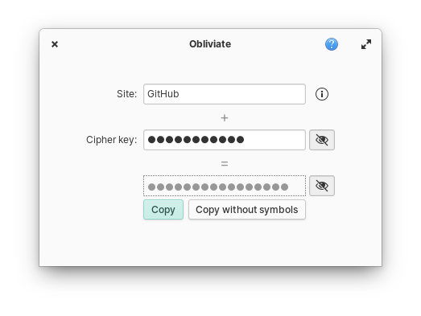

<!--[](https://travis-ci.org/elfenware/obliviate)-->

<p align="center">
   
</p>

<h1 align="center">Obliviate</h1>
<p align="center">A password manager that forgets your passwords</p>

<!--<p align="center">-->
<!--  <a href="https://appcenter.elementary.io/com.github.elfenware.obliviate"></a>-->
<!--</p>-->

<p align="center">
    
</p>

## Description

Obliviate does not store your passwords but gives them to you when you need them. How?

It asks you for two things:

- the site you want to log in to
- a cipher key, which is any passphrase <a href="https://xkcd.com/936/" target="_blank">you can remember</a>

Using these, it will derive a password, which you can set as your new password for that site.

The next time you need it, enter the same site and same cipher key. Obliviate will derive the same password as before.

It’s not magic, but it’s quite close.

### Bonus

If you need your passwords on another device, you can get them on the web from [obliviate.app](https://obliviate.app/).

## Built for elementary OS

While Obliviate will happily compile on any Linux distribution, it is primarily
built for [elementary OS]. **It will be available on AppCenter with the release of elementary OS 6.0 Odin.**

<!--[][appcenter]-->

## Developing and building

Development is targeted at [elementary OS]. If you want to hack on and
build Obliviate yourself, you'll need the following dependencies:

- libgranite-dev
- libgtk-3-dev
- libgcrypt20-dev
- meson
- valac

You can install them on elementary OS Hera with:

```shell
sudo apt install elementary-sdk libgcrypt20-dev
```

Run `meson build` to configure the build environment and run `ninja install`
to install:

```shell
meson build --prefix=/usr
cd build
sudo ninja install
```

Then run it with:

```shell
com.github.elfenware.obliviate
```

[elementary os]: https://elementary.io
[appcenter]: https://appcenter.elementary.io/com.github.elfenware.obliviate

## Credits

- [dotcypress/password](https://github.com/dotcypress/password) for the original idea
- [nemequ/vala-extra-vapis](https://github.com/nemequ/vala-extra-vapis) for the GCrypt VAPI
